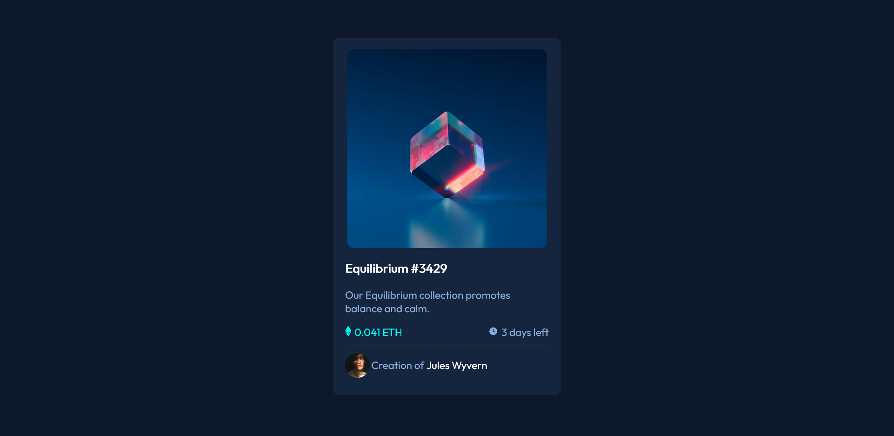

## Table of contents

- [Overview](#overview)
  - [The challenge](#the-challenge)
  - [Screenshot](#screenshot)
  - [Links](#links)
- [My process](#my-process)
  - [Built with](#built-with)
  - [What I learned](#what-i-learned)
  - [Continued development](#continued-development)
  - [Useful resources](#useful-resources)
- [Author](#author)
- [Acknowledgments](#acknowledgments)

## Overview

### The challenge

Users should be able to:

- View the optimal layout depending on their device's screen size
- See hover states for interactive elements

### Screenshot



### Links

- Solution URL: [Solution at Frontend Mentor](https://www.frontendmentor.io/solutions/mobilefirst-workflow-nft-preview-card-component-pGgtUCAX0)
- Live Site URL: [Live Site](https://rayalva407.github.io/NFT-Preview-Card-Component/)

## My process

In this project I decided to work using a mobile-first approach. I built out the project fully as a mobile friendly page first and then worked on the desktop version. I made a quick sketch and decided to make use of semantic html as much as possible. After setting up the inital HTML I got to work on the CSS. From there it was just trial and error with the styling.

### Built with

- Semantic HTML5 markup
- Flexbox
- Mobile-first workflow

### What I learned

In this project I learned a few things about how to position elements. Usually I just use flexbox or grid to position things around but this time I was in a situation where I used float and absolut positioning which was very interesting to me. I also learned how to make an overlay when hovering over an image. This is the code I used for the overlay

```html
<div id="img">
  
  <div id="overlay">
    <svg id="view-icon" width="48" height="48" xmlns="http://www.w3.org/2000/svg"><g fill="none" fill-rule="evenodd"><path d="M0 0h48v48H0z"/><path d="M24 9C14 9 5.46 15.22 2 24c3.46 8.78 12 15 22 15 10.01 0 18.54-6.22 22-15-3.46-8.78-11.99-15-22-15Zm0 25c-5.52 0-10-4.48-10-10s4.48-10 10-10 10 4.48 10 10-4.48 10-10 10Zm0-16c-3.31 0-6 2.69-6 6s2.69 6 6 6 6-2.69 6-6-2.69-6-6-6Z" fill="#FFF" fill-rule="nonzero"/></g></svg>
  </div>
</div>
```
```css
#overlay {
  position: absolute;
  display: flex;
  width: 342px;
  height: 342px;
  opacity: 0;
  transition: .3s ease;
  background-color: hsla(178, 100%, 50%, 0.322);
  justify-content: center;
  align-items: center;
  border-radius: 10px;
}

#img:hover #overlay {
  opacity: 1;
  cursor: pointer;
}
```
It's definitely not a perfect solution but for a first attempt I am proud of what I learned and accomplished with this challenge.

### Continued development

There is one thing that I was not able to complete in this challenge. The profile picture of the creator has a round border around it. I could not get this style to work no matter what I tried! I kept getting a square background no matter what I did. I am going to read more into the box model and do more research on this to see if I can get this resolved.

### Useful resources

- [How to create an overlay](https://www.w3schools.com/howto/howto_css_image_overlay_icon.asp) - This helped me understand what went into creating an overlay over an image. I tooks some of the code from this page and made it my own to fit into my project.

- [Media Queries](https://www.w3schools.com/Css/css3_mediaqueries_ex.asp) - This is an amazing article which helped me finally understand media queries and how they work. I'd recommend it to anyone still learning this concept.

## Author

- Website - [Raymundo Alva](https://rayalva407.github.io)
- Github - [@rayalva407](https://github.com/rayalva407)
- Frontend Mentor - [@rayalva407](https://www.frontendmentor.io/profile/rayalva407)
